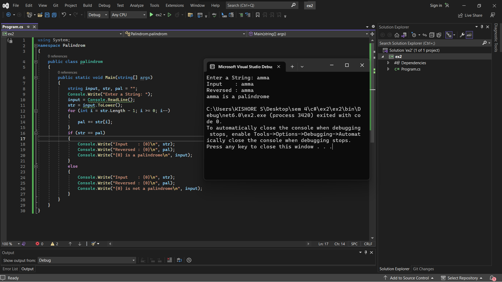
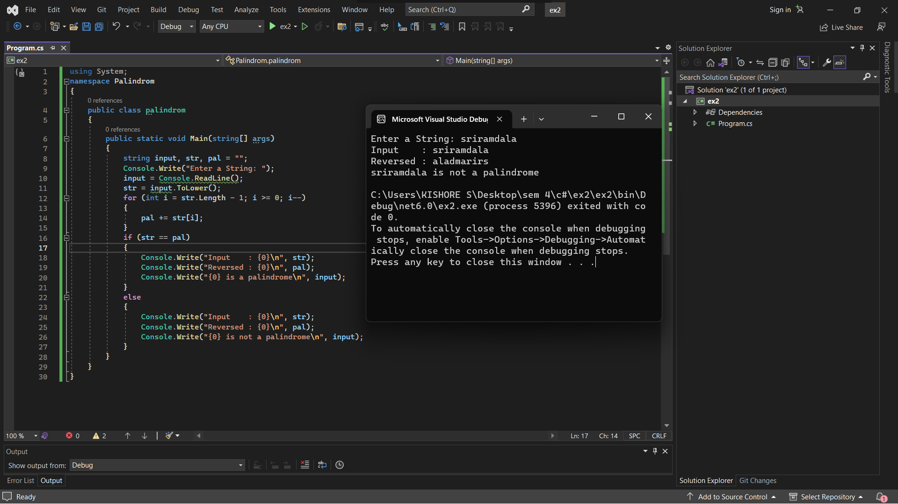

# PALINDROME

## Aim:
To write a C# program to find whether the given string is a Palindrome or not.

## Algorithm:
## Step 1:
Create a new Class named palindrom.

## Step 2:
Declare three variables of string data type.

input - Store the input from user.
str - Convert user input to lower case and store it.
pal - Reverse the string str and store it.
## Step 3:
Get input from the user and store it. Then convert it to lower case.

## Step 4:
Using for loop, iterate through the each character from the end to begining and add it to the new variable called pal

## Step 5:
Using If-else statement check whether the input string & reversed string are same.

## Step 6:
Print the input and reversed string along with the whether palindrom or not.

## Step 7:
End of the Program.

## PROGRAM:
Developed by: Kishore Kumar S

Register no: 212221240023
```
using System;
namespace Palindrom
{
    public class palindrom
    {
        public static void Main(string[] args)
        {
            string input,str,pal="";
            Console.Write("Enter a String: ");
            input = Console.ReadLine();
            str = input.ToLower();
            for (int i = str.Length - 1; i >= 0; i--)
            {
                pal += str[i];
            }
            if (str == pal)
            {
                Console.Write("Input    : {0}\n",str);
                Console.Write("Reversed : {0}\n", pal);
                Console.Write("{0} is a palindrome\n", input);
            }
            else
            {
                Console.Write("Input    : {0}\n",str);
                Console.Write("Reversed : {0}\n", pal);
                Console.Write("{0} is not a palindrome\n", input);
            }
        }
    }
}
```
## OUTPUT:




## RESULT:
Thus the C# program to display whether the given string is Palindrome or not is executed successfully.